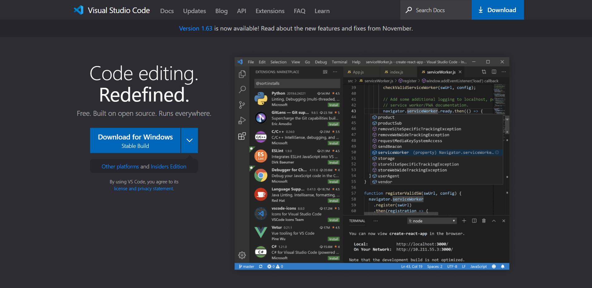

# How To Access Your ieng6 Account 
## Step 1 - Installing VS Code
The first step is just to install a text editor in order to write and edit code. In this case, the editor that I am going to use is Visual Studio Code. In order to install it, I just Googled "Visual Studio Code" in my browser, bringing up the following page: 

From here, click download and follow the instructions to get VS Code set up. 

## Step 2 - Connecting Remotely
The next step is to 

## Step 3 - Trying Out Commands

## Step 4 - scp Command: Moving Files