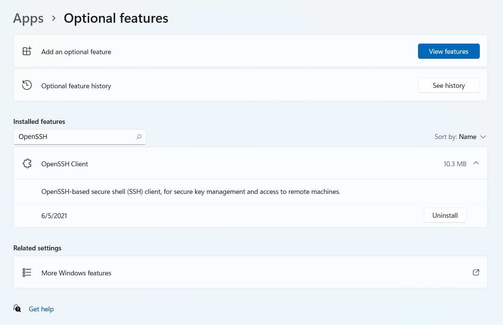
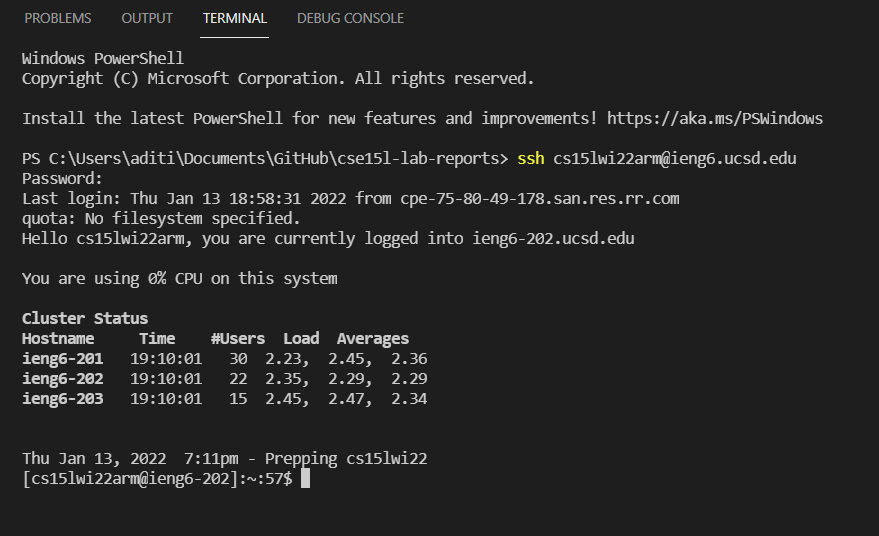
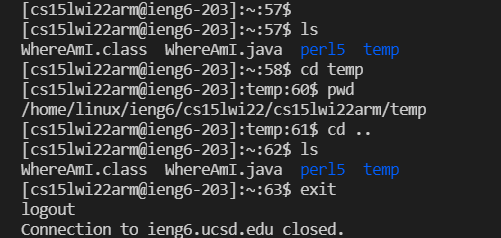
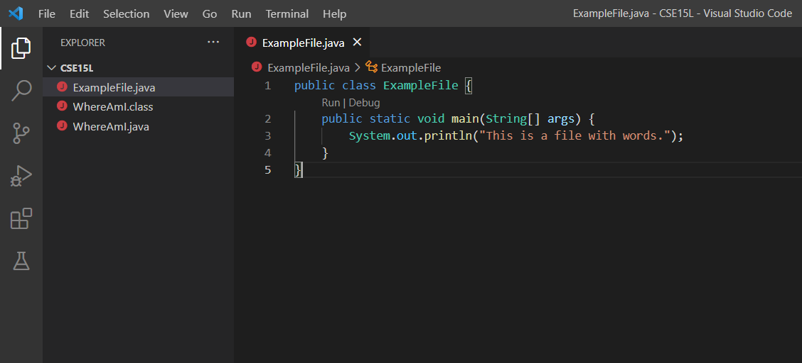
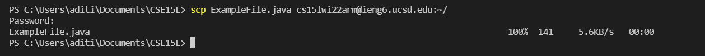
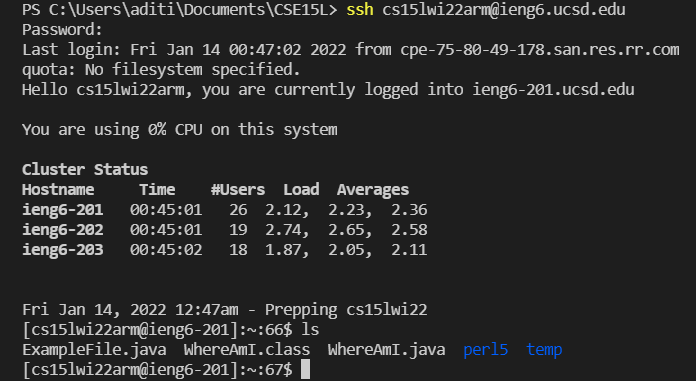
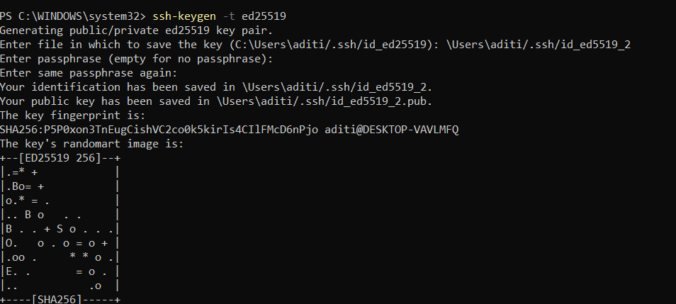
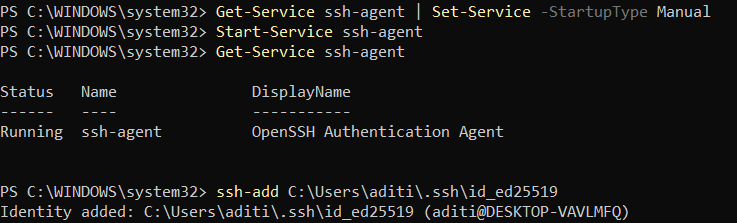
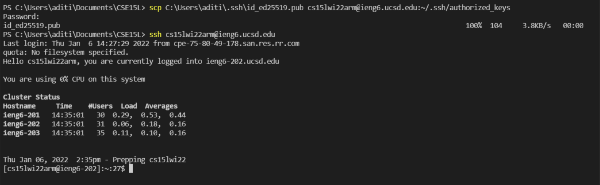
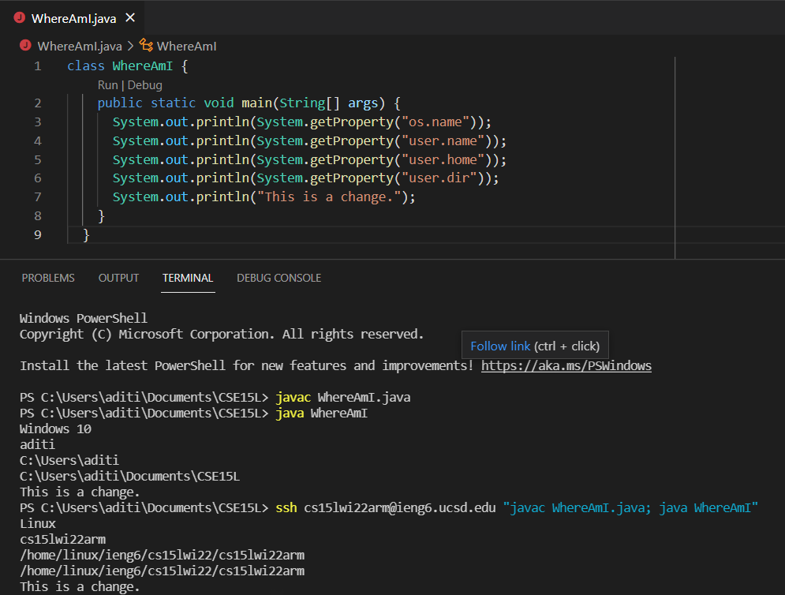

# Lab Report 1
## How To Access Your ieng6 Account 
### Step 1 - Installing VS Code
The first step is to install a text editor in order to write and edit your code. In this case, the editor that I am going to use is Visual Studio Code. In order to install it, I just Googled "Visual Studio Code" in my browser, bringing up the following page: 

From here, click download and follow the instructions to get VS Code set up on your computer. 

### Step 2 - Connecting Remotely
The next step is to set up a remote connection. Before using a course-specific account for the first time, you will need to change the account password at [Password Change](https://sdacs.ucsd.edu/~icc/index.php). This takes around 15 minutes to reset. 

Since I am on a Windows computer, I also had to install OpenSSH. This can be done from settings, going to Apps, then Optional Features. Search for OpenSSH and install, as shown below:

Now, you can open a new terminal in VS Code, and to log in remotely, use the `ssh` command, followed by the course specific account. Once this is entered, the terminal will prompt you to enter your password. You should then be logged in to the server: 

### Step 3 - Trying Out Commands
Now that you can access the remote server, the next step is to be able to use the terminal to execute actions using commands. Some common commands and their uses are:
- `ls` : shows you the contents of the directory you are currently in
- `cd` : allows you to change your directory
- `ls -a` : shows you all the contents of the folder, including hidden files
- `pwd` : prints the path name of the directory you are in
- `exit` : logs out of the server and returns to the local terminal

Here is an example of running some of these commands:

### Step 4 - scp Command: Moving Files
The next step is to copy files from the local computer to the remote server, using the `scp` command. First, you can create a file in your local directory: 

Then, run the `scp` command with the file name and the destination directory (and enter your password):

Now, logging in and using the `ls`command will show that the file is in the remote directory:

### Step 5 - Setting an SSH Key
Setting up an SSH key allows you to log in without entering your password every time. This is very useful in reducing the time it takes to interact with the remote server and whatever you are doing on it. In order to set this up, you will need to first run `ssh-keygen` to generate a public and private key. For Windows, the process looks like this: 

After the key is generated, the key needs to be added. This can be done using `ssh-add` on PowerShell, run as an administrator. The steps are the following commands:

Finally, the public key can be added to the remote server, using `scp`, and you can log in without a password: 

### Step 6 - Optimizing Remote Running
Having the SSH key set up lowers some of the extra time that is taken to run what is needed. Other ways to lessen time taken is to combine commands into a single line, separated by semicolons, instead of having to type and run them individually. If this is done with ssh, the commands should be in quotation marks so that they can all be run remotely. Some examples of using this are:

Here, you can see the difference between running the WhereAmI file, which prints the path, on the local computer and on the remote server using `ssh` and quotes around the commands. 

Another useful way to shorten the time to run a command is to use the up arrow key to get the last commands that were run, especially when you are running the same command multiples times. Specifically, for the last command in the image above, typing out the whole command takes 68 keystrokes. However, the next time the same command needs to be executed, using the up arrow key and then enter is only two keystrokes. Clearly, this will save a lot of time, especially when the program is being worked on and needs to be run multiple times to see if it is working properly.