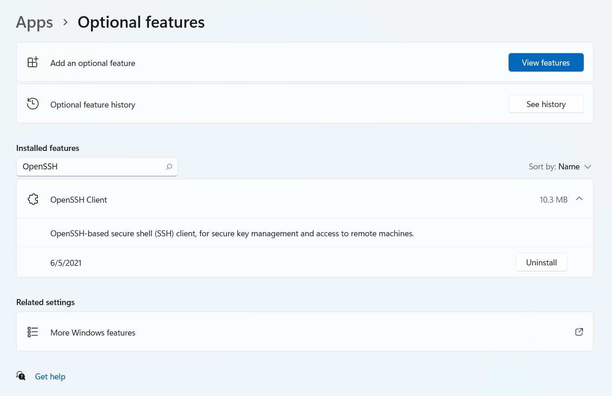

# How To Access Your ieng6 Account 
## Step 1 - Installing VS Code
The first step is to install a text editor in order to write and edit your code. In this case, the editor that I am going to use is Visual Studio Code. In order to install it, I just Googled "Visual Studio Code" in my browser, bringing up the following page: 

From here, click download and follow the instructions to get VS Code set up on your computer. 

## Step 2 - Connecting Remotely
The next step is to set up a remote connection. Before using a course-specific account for the first time, you will need to change the account password at [Password Change](https://sdacs.ucsd.edu/~icc/index.php). This takes around 15 minutes to reset. 

Since I am on a Windows computer, I also had to install OpenSSH. This can be done from settings, going to Apps, then Optional Features, shown below: 

## Step 3 - Trying Out Commands

## Step 4 - scp Command: Moving Files

## Step 5 - Setting an SSH Key

## Step 6 - Optimizing Remote Running