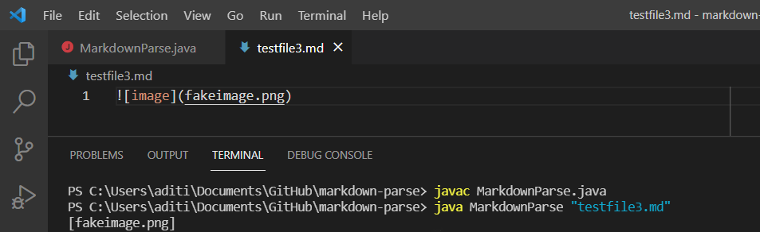
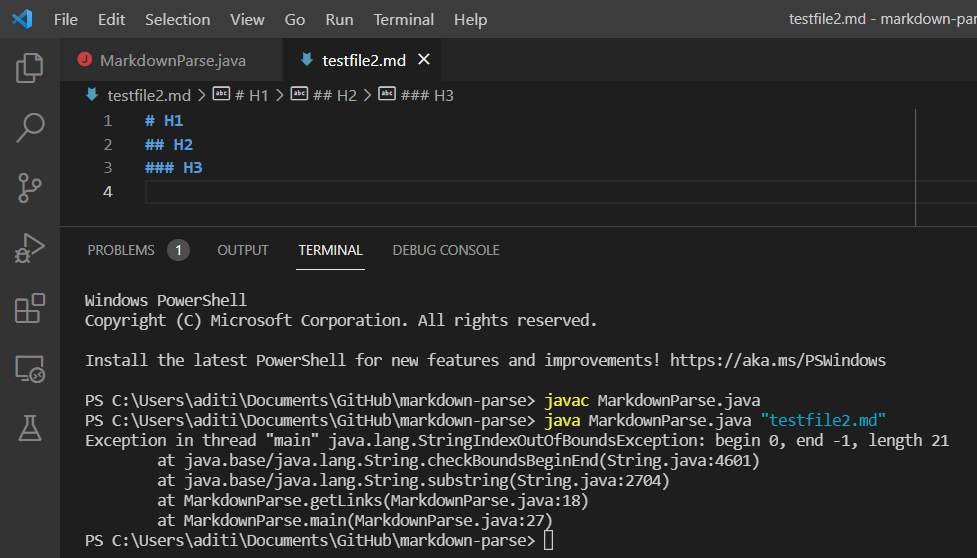
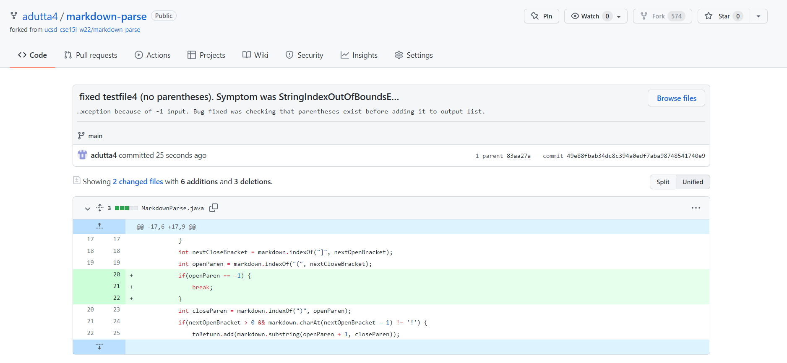

# Lab Report 2
## Tests, Symptoms, and Bugs
### Code Change #1

Test File: [Picture Input Test File](https://github.com/adutta4/markdown-parse/blob/14dfb3ba8ee81a8bc85b25dfd5fc381120ea2139/testfile3.md)  
Symptom: 

In this case, the failure-inducing input is a markdown file that contains an image link only. The symptom is in the output from running the getLinks method with this test file as it returns the image link, while the problem specifies that it should not do so. The bug here is that the code never makes a distinction between image links and website links. Since the structure is so similar, with only one character different, it adds the image link to the returned list in getLinks; the change in code is to make sure that there is no exclamation mark before the link.

### Code Change #2

Test File: [No Links Input File](https://github.com/adutta4/markdown-parse/blob/a71df5c4aeb80a6ef46d417ae92a92404ba1174e/testfile2.md)  
Symptom: 

The failure-inducing input in this case is a markdown file that only contains some headers and no link. In this case, the symptom is the StringIndexOutOfBoundsException that occurs in the image above. The bug in the code is that if the code does not find any brackets, it continues on with the code using the -1 values it gets for nextOpenBracket and subsequent brackets and parentheses. Later, when it reaches the line to substring the link to output it properly, the -1 becomes an invalid argument. Making sure that the value for nextOpenBracket is not invalid fixes the issue and returns an empty list for this input.

### Code Change #3

Test File: [No parentheses Input File](https://github.com/adutta4/markdown-parse/blob/49e88fbab34dc8c394a0edf7aba98748541740e9/testfile4.md)    
Symptom: 

The failure-inducing input is a markdown file that contains square brackets that are not indicative of a link, and there are no parentheses afterwards. The symptom in this case is the StringIndexOutOfBoundException that is thrown on the line `toReturn.add(markdown.substring(openParen + 1, closeParen));`. The bug in the code causing this symptom are the lines immediately preceding this line, that set the indices for the open parentheses and closed parentheses (variables openParen and closeParen) to -1. Fixing this required adding an if statement to check that these values do not equal -1 before proceeding to add the link to the output list.