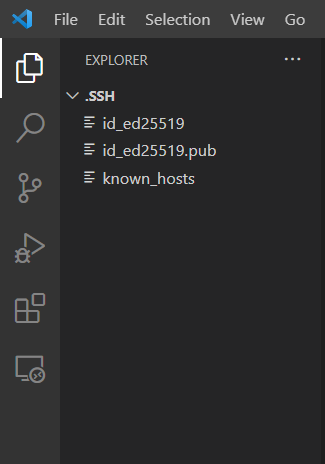
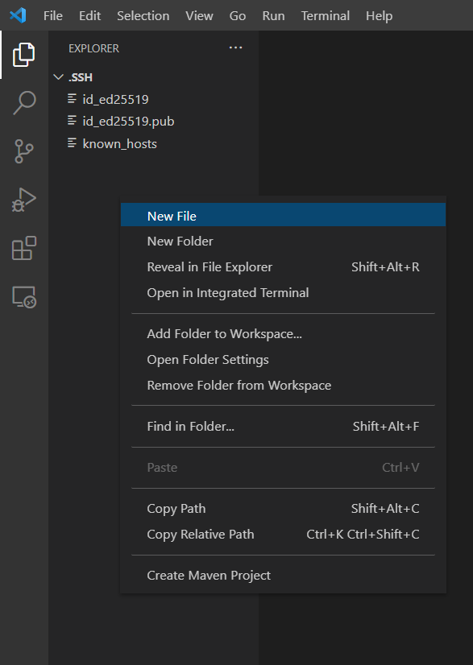
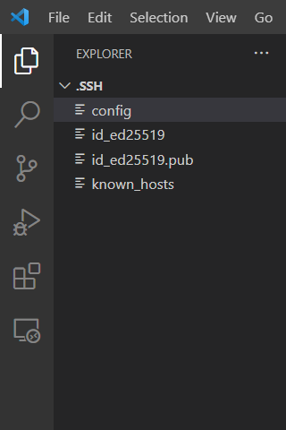
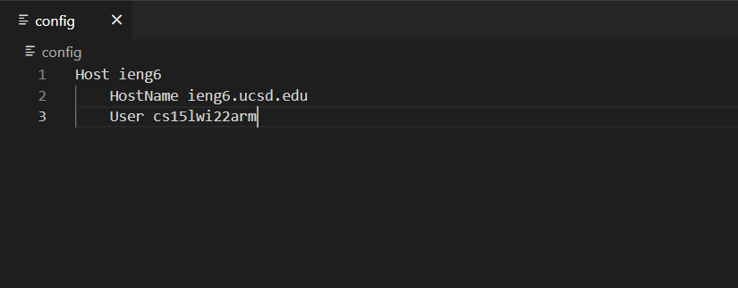
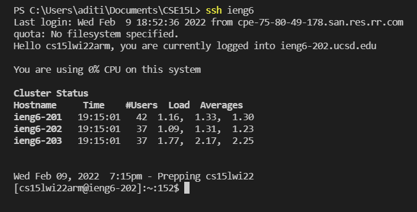
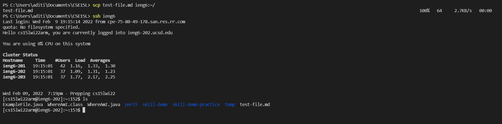

# Lab Report 3
## Streamlining ssh Configuration

The first step in setting up ssh configuration was to create a config file in the ssh folder. I decided to use VS Code to do this. I first opened the .ssh folder in VS Code: 

Then, I created a new file called config:  

To this file, I added the Host, HostName, and User information as in the following: 

Once this file was added and saved, I was able to log in to ssh using only `ssh ieng6` instead of `ssh cs15lwi22arm@ieng6.ucsd.edu`: 

I also tried copying over a file using scp. In this case, instead of having to type out the path for the file as `cs15lwi22arm@ieng6.ucsd.edu:~/`, I was simply able to type `ieng6:~/` to copy the file: 