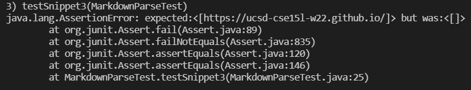

# Lab Report 4
## Markdown Parse Testing

[Link to my markdown-parse repository](https://github.com/adutta4/markdown-parse)  
[Link to reviewed markdown-parse repository](https://github.com/pvijay03/markdown-parse)

### Code Snippet 1
The expected outputs were checked with the [CommonMark website](https://spec.commonmark.org/dingus/): 

The snippet was added to a file called snippet-1.md, and the added test is: 

The test failed for my implementation, with the following output: 

The test failed for the implementation that my lab reviewed, with the following output: 

This code would likely be a more involved change. The code that you would need to add would have to check for the backticks, and make sure that the required parts of the links, such as the brackets in the first line of this snippet, are not within backticks (the reason why the first line is not rendered as a link). At the same time, the other examples above show that backticks are allowed within the brackets and in the link, and these are still rendered as links. As a result, you would need to check the locations of both backticks in relation to the parts of the link to determine whether it is a link or not. 

### Code Snippet 2
The expected output is: 

The snippet was added to a file called snippet-2.md, and the added test is: 

The test failed for my implementation, with the following output:

The test failed for the implementation that my lab reviewed, with the following output: 

This snippet would likely require a more involved change. Currently, the code only look for the next open bracket, without considering that this open bracket could be part of another link or could be escape characters, such as the last line in this snippet. In order to fix this, similar to the backtick fix, the code would need to find each set of brackets and pair them, as well as check the characters before for escape characters. The required code would also need to have a similar function for parentheses, so it would probably require more than 10 lines. 

### Code Snippet 3
The expected output is: 

 

The test file for this snippet is: 

The test failed for my implementation, with the following output: 

The test failed for the implementation that my lab reviewed, with the following output: 

This snippet would also require a more involved change. This is because there seems to be many different rules associated with new lines. For example, new lines seem to be allowed within the brackets if there is text on the new line. However, when there isn't text in the new line, it does not consititute a valid link. There also seem to be similar rules with parentheses, as there can be one new line on either side, but it no longer renders as a link with more than one line on either side. At the same time, there cannot be links inside the text of the link. Because the code has to account for all these different circumstances, this can take more than a few lines of code. 