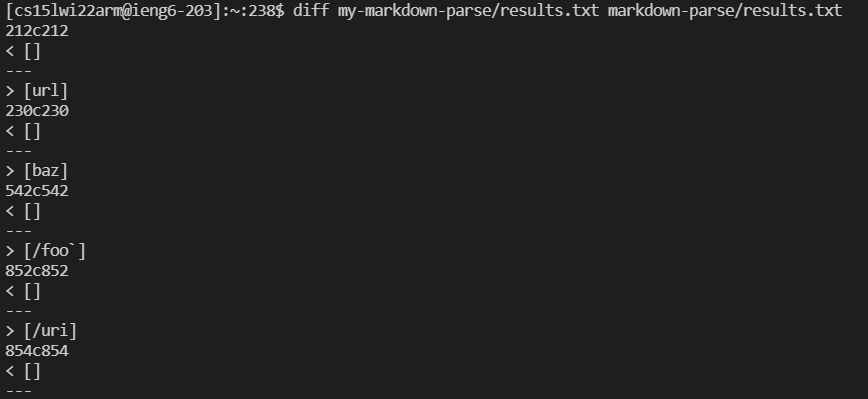
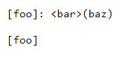
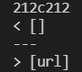
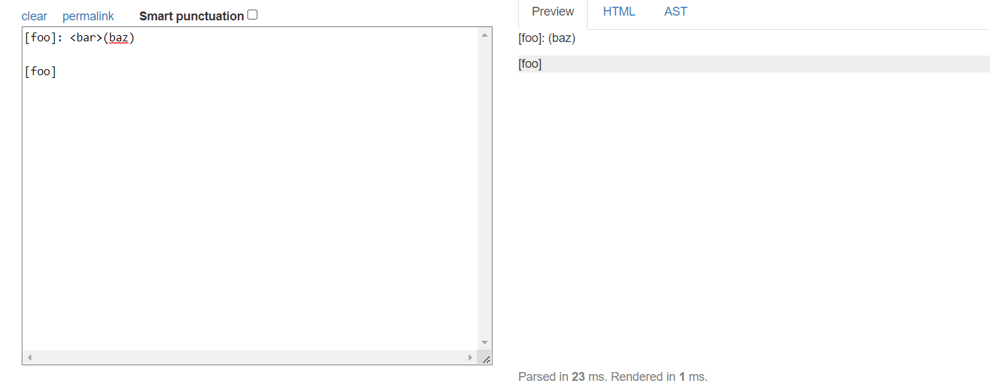
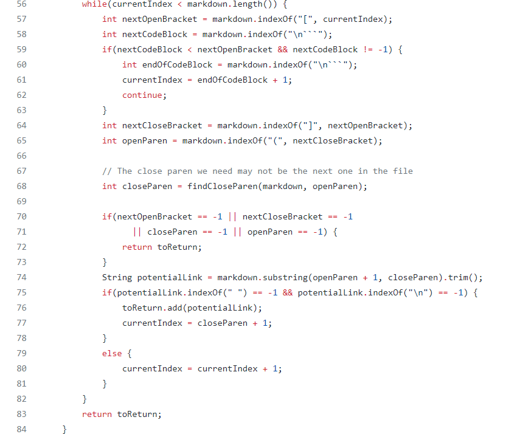
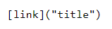
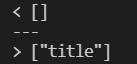
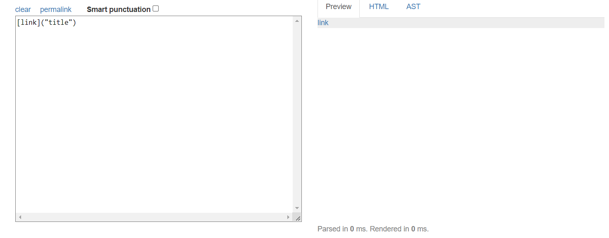
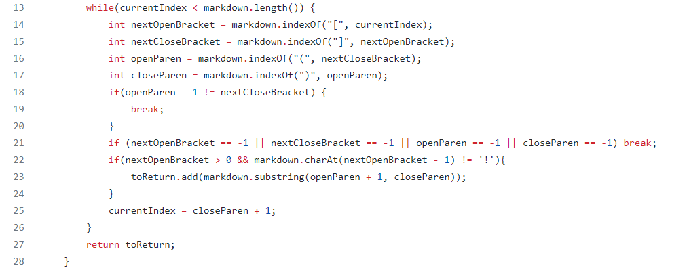

# Lab Report 5
## Testing Markdown Parse

In order to find tests that had different results between my implementation and the provided implementation, I first ran both implementations separately. I then used `diff` on the resulting files to find tests that gave different outputs between both implementations. The output from `diff` indicates the line numbers that the differences occur on, and what the exact output of each implementation is, as shown below: 

### Test 1
The first test that I identified is 201.md, which contains the text:

The output from running `diff` for this test is shown below, where the results from my implementation are at the top, and the results from the provided implementation are at the bottom: 

Using [CommonMark](https://spec.commonmark.org/dingus/), the expected output should have no links:

 

This means that my implementation produces the correct output. For the provided implementation, the bug seems to be that there is no check for whether the open parentheses is located right after the closed bracket or not. Consequently, it finds the next open parentheses regardless of what is in between and considers it a link. In the code below, the code to check the code in between should be added around line 65, when finding the open and closed parentheses:

### Test 2
The second test I identified was 503.md, which contains the text:

The output from running `diff` is:

The CommonMark expected result is that a link is returned: 

The test should return the link, so my implementation is incorrect. The issue here is in the if statement that my lab group added to check that the link is not of an image. In order to do this, the code checks that the index of the first open parentheses is greater than zero before adding a link. This check is done to make sure that there isn't an index out of bounds error when when accessing the index before to check for an exclamation mark, but in doing so, it fails to recognize the current link, which starts from index 0, as a link. The code that should be changed or added to is line 22: 

